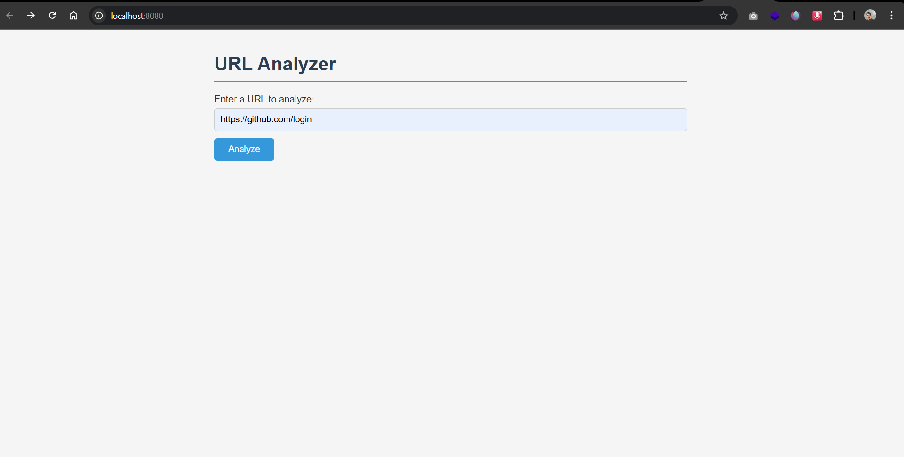
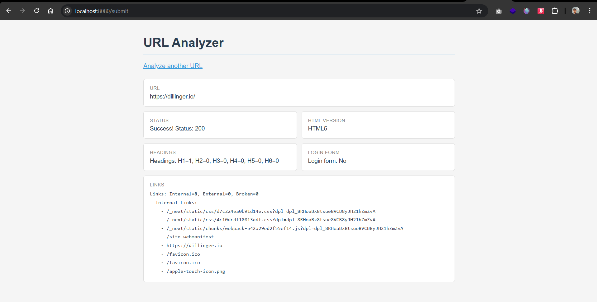

# URL Analyzer

This application analyzes a given URL and return information about its HTML version, headings, links, and whether it has a login form.

---

## Project Overview

Enter the URL in the browser, submit the form, and the app fetches the page and runs several checks on it. The results are displayed on a new page.

**Checks performed:**
- Is the URL reachable?
- What HTML version does the page use?
- How many headings (H1–H6) are on the page?
- How many internal, external, and broken links are there?
- Does the page have a login form?

---

## Prerequisites

- [Go](https://golang.org/dl/) 1.21 or higher

---

## Technologies Used

| Layer | Technology | Purpose |
|-------|-----------|---------|
| Backend | Go (`net/http`) | HTTP server and routing |
| Backend | Go (`html/template`) | HTML rendering (prevents XSS) |
| Backend | Go (`log/slog`) | Structured logging |
| Backend | Go (`net/url`) | URL parsing and validation |
| Backend | Go (`sync`, channels) | Running analyzers concurrently |
| Backend | Go (`io`) | Reading HTTP response |
| Frontend | HTML5 + CSS3 | Input form and result display |
| Frontend | Plain HTML form POST | to avoid using javascripts |
| DevOps | Docker | Multi-stage `Dockerfile` |
| Field Validation | `net/url.ParseRequestURI` | Ensure the submitted value is a valid `http`/`https` URL before processing |

**API / Docs:** No external API or third-party service is used. The app  directly reach to the target URL using Go's built-in HTTP client.

---

## Installation & Running

```bash
# 1. Clone the repository
git clone <your-repo-url>
cd URLAnalyzer

# 2. Run the server
go run main.go
```

Then open your browser at:

```
http://localhost:8080
```

No `go get` or dependency installation step is needed.

### Run with Docker

```bash
# Build the image
docker build -t urlanalyzer .

# Run the container
docker run -p 8090:8080 urlanalyzer
```

Then open `http://localhost:8090` 

---

## Usage

1. Open `http://localhost:8080` in your browser.
2. Type a full URL into the input field (e.g. `https://example.com`).
3. Click **Analyze**.
4. The result page shows:
   - **Status** — whether the URL responded successfully
   - **HTML Version** — detected from the `<!DOCTYPE>` declaration
   - **Headings** — count of H1 through H6 tags
   - **Login Form** — whether a password-based login form was found
   - **Links** — count of internal, external, and broken links, with a full list

Click **Analyze another URL** to go back.

### Landing Page



### Results Page



---

## Key Features Explained

### Concurrency
The four page analyzers (HTML version, headings, links, login form) all run **at the same time** using goroutines and channels. This means the response is faster than running them one by one.

External link status checks inside the link analyzer also run concurrently.

### Logging
All significant events (incoming requests, errors) are logged to the terminal using Go's built-in `slog` package in a readable text format.

### Error Handling
- Invalid or non-http/https URLs are rejected before any network call is made.
- If the target URL is unreachable, the error is shown to the user.
- Analyzer failures are logged as warnings without crashing the server.

### XSS Safety
Results are rendered using Go's `html/template` package, which automatically escapes any characters that could be used for cross-site scripting (XSS) attacks.


## Testing

### Run all tests

```bash
go test ./tests
```

### Unit tests

All unit tests live in the `tests/` directory (`package tests`). No real HTTP requests are made — a local test server (`httptest.NewServer`) is used wherever network calls are needed.

| File | What is tested |
|------|---------------|
| `tests/analyzer_test.go` | DOCTYPE detection, heading counts, login form detection, link counting, reachability |
| `tests/fetch_test.go` | HTML fetching, error on unreachable URL, content casing preservation |
| `tests/handler_test.go` | URL validation — invalid inputs must return 400 Bad Request |

### Integration tests

Integration tests cover the full request flow: 
form submission => URL validation => all analyzers => result page. 
These are **not included** in the unit test suite because they require a live target URL and make real network calls.

To run an integration test manually:
1. Start the server: `go run main.go`
2. Open `http://localhost:8080` and submit a real URL (e.g. `https://example.com`)
3. Verify the result page shows all five fields correctly

---

## Possible Improvements

- **Timeout on full analysis** : add a context deadline so a slow page does not hang the server indefinitely.
- **Proper HTML parsing** : use `golang.org/x/net/html` instead of string matching for more accurate heading/link/form detection.
- **Prometheus metrics** : expose an `/metrics` endpoint to track request counts and latency.
- **pprof profiling** : add `/debug/pprof` for performance investigation in development.
- **Pagination for links** : pages with hundreds of links make the result hard to read.


## External resources Used

- [**Video references**](https://www.youtube.com/watch?v=yyUHQIec83I)
- [**Gorutines**](https://gobyexample.com/channels)
- [**Unit test**](https://www.freecodecamp.org/news/unit-testing-in-go-a-beginners-guide/)
- [**MD file creations**](https://dillinger.io/)